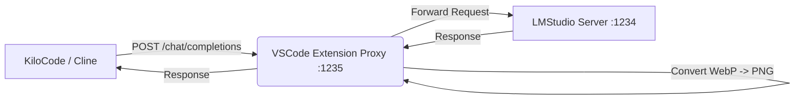

# 📸 LMStudio Screenshot Fixer (Proxy)


[](https://opensource.org/licenses/MIT)

**The missing link between KiloCode (or Cline) and LMStudio's Vision Models.**

This VSCode extension automatically fixes the dreaded `"url field must be a base64 encoded image"` error when AI assistants try to send screenshots to LMStudio.

It runs heavily tested **WebP → PNG** conversion in the background using a robust proxy server, ensuring your local vision models can see what's on your screen.

## 🚀 Key Features

- **✅ Zero Config**: Installing the extension is (almost) all you need to do.
- **🔄 Auto-Conversion**: Intercepts screenshot requests and instantly converts them to base64 PNGs.
- **🖼️ WebP Support**: Fixes the #1 issue where LMStudio rejects WebP images sent by AI agents.
- **⚡️ Native Performance**: Spawns a lightweight background process using your system's Node.js.
- **🐛 Debug Mode**: View live logs of image conversion traffic right in VSCode.

## 📥 Installation

1. Install the extension from the VSCode Marketplace (Coming Soon).
2. Or build locally:
   ```bash
   git clone https://github.com/amitrathiesh/lmstudio-proxy.git
   cd lmstudio-proxy
   npm install
   npm install -g @vscode/vsce
   npx vsce package
   # Then install the .vsix in VSCode
   ```

## 🛠 Usage

1. **Start the Proxy**: The extension starts automatically when you open VSCode.
   - You'll see `$(radio-tower) Proxy: ON` in your status bar.

2. **Configure Your AI Assistant (e.g., KiloCode)**:
   - Change your LLM Provider URL to point to the proxy:
   - **Original**: `http://localhost:1234` (Direct to LMStudio)
   - **Proxy**: `http://localhost:1235` (Through this extension)

3. **That's it!** 
   - Take screenshots as normal.
   - The proxy intercepts the request.
   - Converts the image.
   - Forwards it to LMStudio.
   - Returns the response.

## ⚙️ Configuration

You can customize settings in VSCode (`Cmd+,`) under **"LMStudio Proxy"**:

| Setting | Default | Description |
|---------|---------|-------------|
| `lmstudioProxy.port` | `1235` | The port the proxy listens on. |
| `lmstudioProxy.targetUrl` | `http://localhost:1234` | Your actual LMStudio server address. |
| `lmstudioProxy.autoStart` | `true` | Automatically start the proxy when VSCode opens. |

## 📐 Architecture



## 🐛 Troubleshooting

**"Proxy Failed to Start"**
- Check if port 1235 is already in use. Change the port in Settings.
- View Logs: Run command `LMStudio Proxy: Show Proxy Logs` (Cmd+Shift+P).

**"Images still failing"**
- Ensure your AI tool is actually pointing to `:1235`, not `:1234`.
- Check the Output channel logs to see if the request is hitting the proxy.

## 👤 Author

**Amit Rathiesh** (Webzler Solutions Inc.)
- Email: amitrathiesh@webzler.com
- Website: [www.webzler.com](https://www.webzler.com)
- GitHub: [@amitrathiesh](https://github.com/amitrathiesh)

## 🤝 Contributing

Contributions are welcome!
1. Fork the repo
2. Create feature branch (`git checkout -b feature/amazing-feature`)
3. Commit changes (`git commit -m 'Add amazing feature'`)
4. Push to branch (`git push origin feature/amazing-feature`)
5. Open a Pull Request

## 📝 License

MIT License - Copyright (c) 2025 Amit Rathiesh
