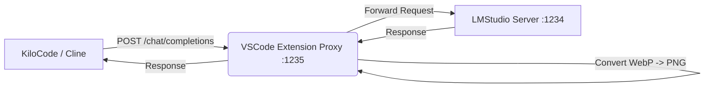

# 📸 LMStudio Proxy (Screenshot Fix)

**The missing link between AI Coding Assistants (KiloCode, Cline, Roo-Code) and LMStudio.**

This extension fixes the common error:
> **`[Server Error] 'url' field must be a base64 encoded image`**

If you use LMStudio with local vision models, you've likely hit this wall. AI agents often send image paths (e.g., `/tmp/screenshot.png`) or WebP files, but LMStudio requires base64-encoded strings.

 This extension sits in the middle, transparently converting everything for you.

## 🚀 Key Features

- **✅ Fixes the "Base64" Error**: Automatically converts internal file paths to data URIs.
- **🖼️ WebP Support**: Solves the issue where LMStudio rejects WebP screenshots (default in many agents).
- **⚡️ Zero-Config**: Runs in the background automatically.
- **🔍 Debug Mode**: See exactly what your AI agent is sending to LMStudio.

## 📥 Installation

1. Open **VSCode Extensions** (Cmd+Shift+X).
2. Search for **"LMStudio Proxy"**.
3. Install the extension by **Webzler Solutions Inc.**
4. That's it! It runs automatically.

## 🛠 Usage

1. **Verify it's Running**:
   - Look for `$(radio-tower) Proxy: ON` in your VSCode Status Bar (bottom right).

2. **Configure Your AI Assistant**:
   - Point your AI tool (KiloCode, Cline, Roo-Code, etc.) to the proxy port.
   - **Proxy URL**: `http://localhost:1235`
   - *(Original LMStudio is at `:1234`, Proxy is at `:1235`)*

3. **Enjoy**:
   - Take screenshots in your AI chat. They will now work perfectly with your local vision model.

## ⚙️ Configuration

You can customize settings in VSCode (`Cmd+,`) under **"LMStudio Proxy"**:

| Setting | Default | Description |
|---------|---------|-------------|
| `lmstudioProxy.port` | `1235` | The port the proxy listens on. |
| `lmstudioProxy.targetUrl` | `http://localhost:1234` | Your actual LMStudio server address. |
| `lmstudioProxy.autoStart` | `true` | Automatically start the proxy when VSCode opens. |

## 📐 Architecture

## 🐛 Troubleshooting

**"Proxy Failed to Start"**
- Check if port 1235 is already in use. Change the port in Settings.
- View Logs: Run command `LMStudio Proxy: Show Proxy Logs` (Cmd+Shift+P).

**"Images still failing"**
- Ensure your AI tool is actually pointing to `:1235`, not `:1234`.
- Check the Output channel logs to see if the request is hitting the proxy.

## 👤 Author

**Amit Rathiesh** (Webzler Solutions Inc.)
- Email: amitrathiesh@webzler.com
- Website: [www.webzler.com](https://www.webzler.com)
- GitHub: [@amitrathiesh](https://github.com/amitrathiesh)

## 🤝 Contributing

Contributions are welcome!
1. Fork the repo
2. Create feature branch (`git checkout -b feature/amazing-feature`)
3. Commit changes (`git commit -m 'Add amazing feature'`)
4. Push to branch (`git push origin feature/amazing-feature`)
5. Open a Pull Request

## 📝 License

MIT License - Copyright (c) 2025 Amit Rathiesh
